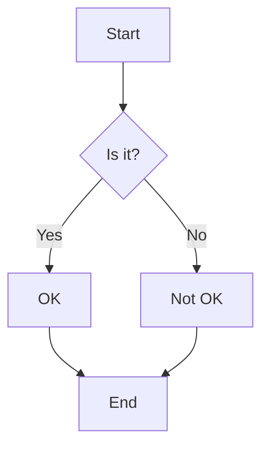
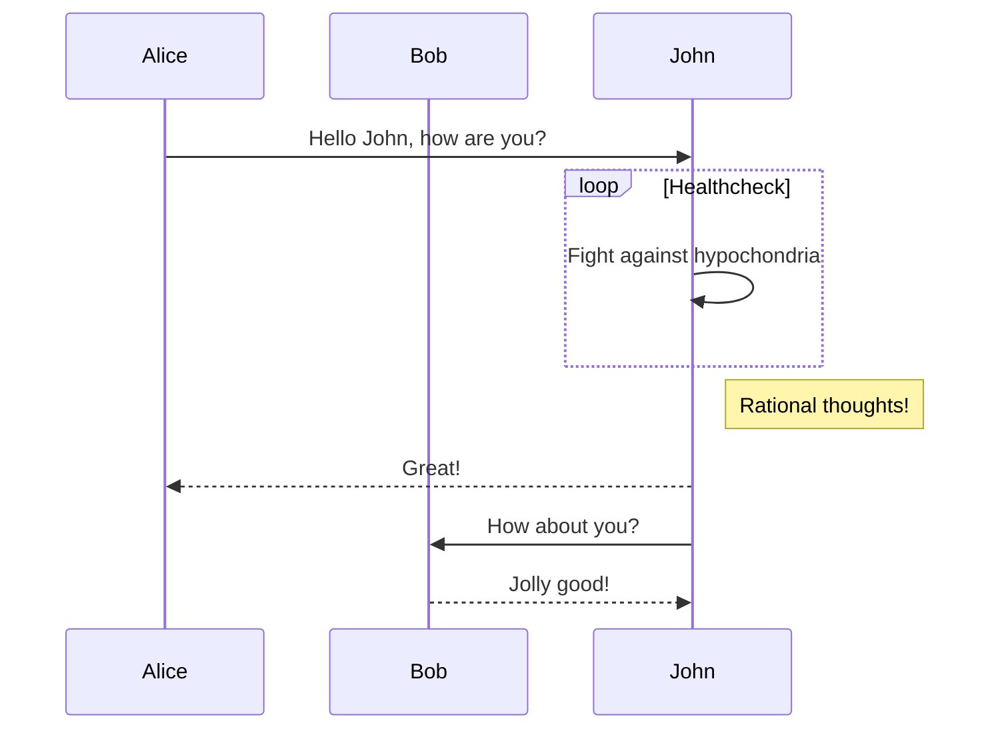
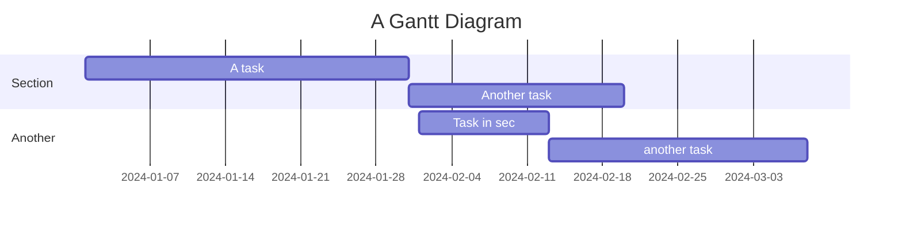

# Markdown Showcase

This post showcases the various features available in Markdown.

## Headers

# H1 Header
## H2 Header
### H3 Header
#### H4 Header
##### H5 Header
###### H6 Header

## Text Formatting

- **Bold text**
- *Italic text*
- ~~Strikethrough text~~
- `Inline code`

## Lists

### Unordered List

- Item 1
- Item 2
  - Subitem 1
  - Subitem 2

### Ordered List

1. First item
2. Second item
   1. Subitem 1
   2. Subitem 2

## Links

Example Link: [example link](https://www.example.com).

## Images


## Blockquotes

> This is a blockquote.

## Code Blocks

### C#
```csharp
using System;

class Program
{
    static void Main()
    {
        Console.WriteLine("Hello, World!");
    }
}
```

### Go
```go
package main

import "fmt"

func main() {
    fmt.Println("Hello, World!")
}
```

### PHP
```php
<?php
echo "Hello, World!";
?>
```

### JavaScript
```javascript
console.log("Hello, World!");
```

### Kotlin
```kotlin
fun main() {
    println("Hello, World!")
}
```

### Swift
```swift
import SwiftUI

struct ContentView: View {
    var body: some View {
        Text("Hello, World!")
    }
}
```

### Bash
```bash
#!/bin/bash
echo "Hello, World!"
```

### Elixir
```elixir
IO.puts("Hello, World!")
```

## Tables

| Header 1 | Header 2 | Header 3 |
|----------|----------|----------|
| Row 1    | Data     | More Data|
| Row 2    | Data     | More Data|
| Row 3    | Data     | More Data|

## Graphs

### Embedding Graph Images


### Embedding Mermaid


#### sequenceDiagram


#### gantt



## Embeds

### YouTube Video

<iframe width="560" height="315" src="https://www.youtube.com/embed/dQw4w9WgXcQ" frameborder="0" allowfullscreen></iframe>


### GitHub Gist

<script src="https://gist.github.com/username/gist-id.js"></script>
